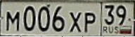

### Пайплайн:
- Детекция+сегментация с maskrcnn_resnet50_fpn (credit to https://www.kaggle.com/alyar88/maskrcnn-bb-x-mask-crnn-0-53)  
- Для каждого баундинг бокса предсказываем относительные координаты углов (регрессия через resnet50 на 8 аутпутов, обучал на приведенных к одному размеру баундинг боксах исходных данных)  
- Относительные координаты переводим в абсолютные, вырезаем только номер используя https://www.kaggle.com/glebmihaescu/perspective-transform.  
Таким образом, фон практически не попадает в баундинг бокс:

  
- На получившейся фотографии запускаем recognition часть из бейзлайна (поменял бэкбоун на resnet50, использовал bidirectional GRU, тренировался на картинках, полученных трансформом выше, а не из бейзлайна)

